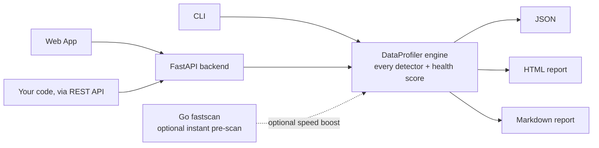

# 🕵️ Data Detective

[](https://github.com/murs5l/data-detective/actions/workflows/tests.yml)
[](https://github.com/murs5l/data-detective/actions/workflows/tests.yml)
[](https://pypi.org/project/data-detective-toolkit/)
[](https://github.com/murs5l/data-detective/blob/main/.github/workflows/tests.yml)
[](https://github.com/murs5l/data-detective/pkgs/container/data-detective)
[](https://github.com/astral-sh/ruff)
[](LICENSE)

**Point Data Detective at a CSV. Get back a graded, explainable data-quality report in seconds**, as a CLI, a web app, or a REST API, all backed by one profiling engine.

Most profiling tools hand you a wall of statistics and leave you to decide what matters. Data Detective adds a single 0-100 **health score you can actually explain**, and ships as a real tool (CLI, API, Docker image), not just a notebook cell.

## Demo


## Why Data Detective

- **Explainable, not a black box.** The health score comes with a full breakdown: every point deducted is traceable to a named cause.
- **A real product, not just a notebook cell.** CLI, web app, REST API, and a Docker image, pick the interface that fits, without gluing one together yourself.
- **Built for CI, not just exploration.** Markdown export is designed to be pasted straight into a GitHub PR comment.
- **Private by default.** Everything runs locally; your data is never uploaded anywhere.
- **Fast enough to run on every commit.** 100,000 rows in well under a second (see [Benchmarks](#benchmarks)).

## Features

- **20+ automated checks**: missing values, duplicates, outliers (IQR & MAD), correlations, skew, mixed types, high-cardinality/ID-like columns, and more ([full list](docs/detectors.md))
- **A 0-100 Dataset Health Score** with a fully inspectable breakdown ([details below](#dataset-health-score))
- **Three interfaces, one engine**: CLI, web app, and REST API, all backed by the same `DataProfiler`
- **Three export formats**: JSON, standalone HTML, and PR/CI-ready Markdown
- **Runs fully local**: your data never leaves your machine

## Quick start

**Web app** (interactive, no command line needed):
```bash
git clone https://github.com/murs5l/data-detective.git
cd data-detective
docker compose up --build
```
Open **http://localhost:8000** and drag in a CSV.

**CLI** (for scripts and CI):
```bash
pip install data-detective-toolkit
data-detective analyze myfile.csv --html
```
> The PyPI package is `data-detective-toolkit`; the installed command is `data-detective`.

Full flag reference, running the API without Docker, and using it as a Python library: see [Documentation](#documentation) below.

## Try it without installing

A small synthetic dataset with realistic messiness (missing values, injected
outliers, a duplicate row) lives in [`examples/`](examples/), generated by a
seeded, reproducible script so anyone can regenerate it byte-for-byte:

- [Sample data](examples/sample_data.csv): 1,000 rows
- [Sample Markdown report](examples/sample_report.md): renders directly on GitHub
- [Sample HTML report](examples/sample_report.html): download and open in a browser

## Screenshots

<table>
<tr>
<td width="50%"><br /><sub>Insights lead the report, color-coded by severity.</sub></td>
<td width="50%"><br /><sub>Column Explorer: drill into one column at a time.</sub></td>
</tr>
</table>

## Dataset Health Score

Every report leads with one number: a 0-100 score with a letter grade, so you
can gauge data quality at a glance before reading a single technical table.

**What it is:** a deterministic function of the data. 100 points, minus a
capped deduction for each of 9 issue categories (missing values, duplicate
rows, outliers, duplicate/constant/mixed-type columns, unexpected negatives,
skewed distributions, redundant correlated columns). No model, no randomness,
no external calls; the same CSV always produces the same score.

**Why it exists:** most profiling tools hand you dozens of independent
statistics and leave you to decide what's actually wrong. The health score
does that triage for you, without hiding how it got there.

**Why it's explainable, not a black box:** the CLI, API, and web app all
return the full breakdown alongside the score, exactly how many points each
category cost, so you can always answer "why is this a 64, not a 90?"

Example, from the [sample dataset](examples/sample_data.csv) above:

```
Data Health Score: 64/100 (Fair)

  Missing Values          -15.8
  Outliers                -15.0
  Skewed Distributions     -5.0
```

## Architecture

The CLI, web app, and REST API are three interfaces over one profiling
engine, not three separate implementations. `DataProfiler` holds every
detector, missing values, outliers, correlations, the health score, and is
the only place that logic lives. Add a detector once, and it's instantly
available everywhere the tool is used.



The Go speed layer is a pure optimization, not a dependency: `quick_scan.py`
checks whether the `fastscan` binary is present and returns `None` cleanly if
it isn't, so the app works identically (just without the instant pre-scan
stat) on a plain `pip install` with no Go toolchain.

<details>
<summary>Full project structure</summary>

```
data-detective/
├── src/data_detective/       # Core engine + CLI - the shared source of truth
│   ├── profiler.py           # DataProfiler: every detector, the health score
│   ├── cli.py                # `data-detective` command-line entry point
│   ├── loader.py             # CSV loading, with encoding fallback for messy files
│   ├── html_report.py        # Static HTML report renderer
│   ├── markdown_report.py    # Markdown report renderer (for PR/CI comments)
│   └── report.py             # Plain-text report printer (CLI default output)
├── backend/app/              # FastAPI wrapper around the same DataProfiler
│   ├── main.py               # /api/analyze, /html, /markdown endpoints
│   └── quick_scan.py         # Optional Go fastscan integration
├── frontend/                 # Dependency-free HTML/CSS/vanilla JS web app
├── tools/fastscan/           # Optional Go speed layer (instant CSV pre-scan)
├── tests/, backend/tests/    # Core engine tests, API tests
├── examples/                 # Sample dataset + generated sample HTML/Markdown reports
├── docs/                     # Detailed docs, README images/GIF, coverage badge
├── scripts/                  # Maintenance scripts (coverage badge, benchmark data)
└── .github/workflows/        # CI (tests, lint, typecheck, coverage) + release automation
```

</details>

## Comparison

An honest, feature-based comparison against two well-known Python profiling
libraries. This isn't a performance shootout, it's about which surfaces each
project ships.

| | Data Detective | ydata-profiling | Sweetviz |
|---|---|---|---|
| CLI tool | ✅ | Library-only | Library-only |
| REST API | ✅ | ❌ | ❌ |
| Web upload interface | ✅ | ❌ | ❌ |
| Markdown export (PR/CI-ready) | ✅ | ❌ | ❌ |
| Single explainable health score | ✅ | ❌ | ❌ |
| Docker image | ✅ | ❌ | ❌ |
| Runs fully local | ✅ | ✅ | ✅ |

Both ydata-profiling and Sweetviz produce excellent, more visually dense
single-file HTML reports and are worth using directly inside a notebook.
Data Detective's niche is different: a lightweight tool meant to run
unattended, in CI, on every commit, with a score you can gate on instead of
a report you have to read.

*Reflects each project's public documentation as of writing (2026-07);
verify before deciding, tools evolve.*

## Benchmarks

Measured via the CLI's full analyze path (`--json --quiet`), median of 3
runs, on an Apple M5 (macOS), Python 3.9.6:

| Dataset size | Runtime |
|---|---|
| 1,000 rows | 0.20s |
| 10,000 rows | 0.25s |
| 100,000 rows | 0.65s |
| 1,000,000 rows | 5.3s |

Reproduce it yourself:
```bash
python scripts/generate_benchmark_data.py 100000 bench.csv
time data-detective analyze bench.csv --json --quiet > /dev/null
```

Numbers will vary by machine; the scaling curve matters more than the
absolute number on any one laptop.

## Roadmap

Ideas being explored, not commitments:

- **Dataset comparison**: diff two profiling runs (e.g. today's data vs. last week's) to see what changed
- **Schema drift detection**: flag when incoming data's shape or types no longer match a prior baseline
- **Data contracts**: validate incoming data against a declared schema/rule file, and fail CI on violation
- **Plugin architecture**: register custom detectors without forking the engine
- **Historical quality tracking**: store health scores over time and chart the trend
- **Additional data sources**: Parquet, JSON, database connections
- **A GitHub Action**: wrap the CLI as a first-class CI data-quality gate

## Documentation

- [CLI reference](docs/cli-reference.md): installation, all flags, examples
- [REST API reference](docs/api-reference.md): endpoints, Python/JS examples
- [Full detector list](docs/detectors.md): all 20+ checks in detail
- [Advanced usage](docs/advanced-usage.md): CI/PR integration, batch processing, using it as a Python library
- [Contributing](CONTRIBUTING.md): dev setup, testing, releasing

## License

See [LICENSE](LICENSE).
