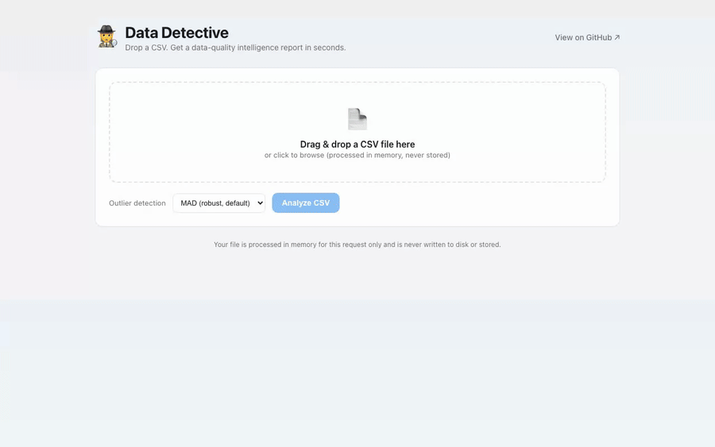
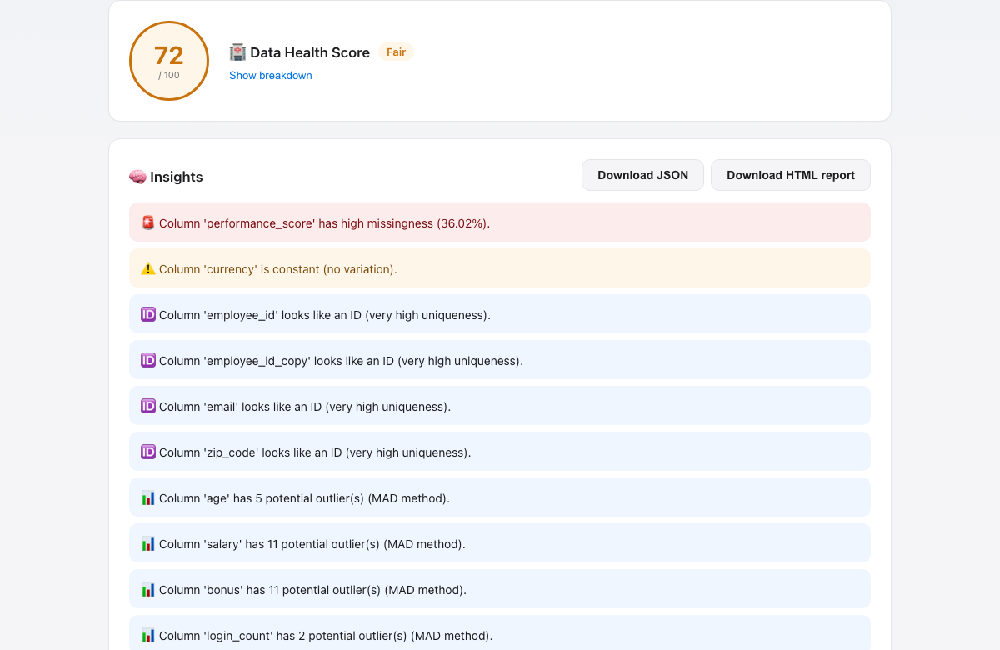
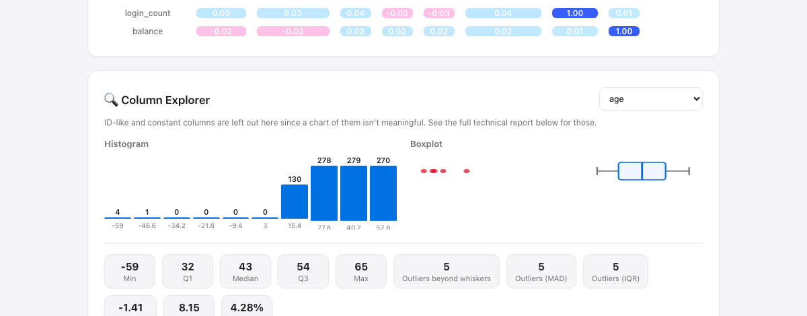

# 🕵️ Data Detective

[](https://github.com/murs5l/data-detective/actions/workflows/tests.yml)
[](https://pypi.org/project/data-detective-toolkit/)
[](https://github.com/murs5l/data-detective/blob/main/.github/workflows/tests.yml)
[](https://github.com/murs5l/data-detective/pkgs/container/data-detective)
[](https://github.com/astral-sh/ruff)
[](LICENSE)

**Automated data quality profiling in seconds.** Point Data Detective at a CSV and get back an intelligent report: shape, data types, missing values, duplicates, outliers, correlations, distribution skew, ID-like columns, and actionable insights. Choose your interface: fast CLI for scripts and CI, browser-based web app for exploration, or REST API for integration.



### Why Data Detective?

- **Fast**: profiles 1000+ rows in under a second
- **Thorough**: detects 20+ data quality issues (outliers, duplicates, high cardinality, mixed types, skew, etc.)
- **Private**: your data never leaves your machine; everything runs locally
- **Flexible**: use as a CLI tool, web app, Python library, or REST API
- **Lightweight**: no external ML services or cloud dependencies

### Two ways to use it

1. **CLI**: `data-detective analyze myfile.csv --html` for scripts and CI pipelines.
2. **Web app**: `docker compose up` for interactive exploration with live charts.

Both interfaces use the same profiling engine and produce identical reports.

---

## Quick start

### Web app (interactive, no command line needed)

The easiest way to explore a CSV:

```bash
git clone https://github.com/murs5l/data-detective.git
cd data-detective
docker compose up --build
```

Then open **http://localhost:8000**, drag and drop a CSV, and explore. The report includes:
- Data shape and types
- Missing value heatmap
- Column Explorer: drill down into any numeric column to see histogram, boxplot, and 5-number summary
- Outlier detection (IQR and MAD methods)
- Correlation heatmap for numeric column pairs
- Insights highlighted in plain English

The browser-based UI is designed for non-technical and technical users alike: actionable insights appear first, and granular technical details are tucked behind a "Full technical report" toggle.

<table>
<tr>
<td width="50%"><br /><sub>Insights lead the report, color-coded by severity.</sub></td>
<td width="50%"><br /><sub>Column Explorer: drill into one column at a time.</sub></td>
</tr>
</table>

**Running without Docker:** if you have Python and FastAPI installed:
```bash
pip install -e ".[api]"
uvicorn backend.app.main:app --reload
```
Then visit `http://localhost:8000`.

### CLI (scripting and CI/CD)

Install locally for use in scripts and automated pipelines:

```bash
pip install data-detective-toolkit
data-detective analyze myfile.csv
```

> The PyPI package is `data-detective-toolkit`; the installed command is `data-detective`.

See [CLI docs](#cli) below for all flags and output formats.

## CLI reference

### Installation

```bash
pip install data-detective-toolkit
```

> **macOS tip:** if `data-detective` comes back as `command not found` right after
> installing, pip likely fell back to a `--user` install (common on macOS's system
> Python, since its site-packages isn't writeable) and the resulting `bin/` folder
> isn't on your `PATH`. Two fixes:
>
> - **Recommended:** install with [pipx](https://pipx.pypa.io) instead, which
>   installs CLI tools in an isolated environment and wires up `PATH` for you.
>   Run each line separately, then restart your terminal before the last step:
>   ```bash
>   brew install pipx
>   pipx ensurepath
>   ```
>   ```bash
>   pipx install data-detective-toolkit
>   ```
>   (No Homebrew? Use `python3 -m pip install --user pipx` instead of the first line.)
> - **Or** find where pip actually put it and add that to your `PATH`:
>   ```bash
>   python3 -m site --user-base
>   ```
>   This prints something like `/Users/you/Library/Python/3.9`. Add `<that path>/bin`
>   to `PATH` in `~/.zshrc`, then restart your terminal.

### Basic usage

```bash
# Print a text summary to stdout
data-detective analyze myfile.csv

# Generate an interactive HTML report
data-detective analyze myfile.csv --html

# Output JSON for programmatic use
data-detective analyze myfile.csv --json | jq '.insights'

# Write to specific files
data-detective analyze myfile.csv --output-html reports/q1_data.html
```

### Options

| Flag               | Description                                      | Example |
|--------------------|-------------------------------------------------|---------|
| `--json`           | Print full report as JSON to stdout              | `data-detective analyze data.csv --json` |
| `--html`           | Generate `report.html` in current directory      | `data-detective analyze data.csv --html` |
| `--output-json`    | Write JSON report to a specific file path         | `--output-json reports/profile.json` |
| `--output-html`    | Write HTML report to a specific file path         | `--output-html reports/profile.html` |
| `--outlier-method` | Choose outlier detection: `iqr` or `mad` (default) | `--outlier-method iqr` |
| `--quiet`          | Suppress non-error progress messages              | `--quiet` |

### Examples

**CI/CD pipeline**: fail if data quality issues exceed a threshold
```bash
data-detective analyze incoming.csv --json | jq '.outliers_mad | length' | xargs -I {} bash -c 'exit {}'
```

**Batch processing**: profile all CSVs in a directory
```bash
for f in data/*.csv; do
  data-detective analyze "$f" --output-html "reports/$(basename $f .csv).html"
done
```

**Data validation**: check for specific issues before ETL
```bash
data-detective analyze input.csv --quiet --json | jq '.high_cardinality_columns'
```

## REST API (for integration)

When running the web app or backend API server, you can integrate Data Detective into your own applications.

### Endpoints

**POST /api/analyze** – Analyze a CSV file, return JSON report
```bash
curl -F "file=@data.csv" "http://localhost:8000/api/analyze?outlier_method=mad"
```

Response: JSON object with all profiling data (see example below).

**POST /api/analyze/html** – Analyze a CSV file, return standalone HTML report
```bash
curl -F "file=@data.csv" "http://localhost:8000/api/analyze/html" > report.html
```

Response: A self-contained HTML file (no external dependencies).

**GET /api/health** – Health check
```bash
curl http://localhost:8000/api/health
```

Response: `{"status": "ok", "version": "0.3.0"}`

### Python example

```python
import requests

with open("mydata.csv", "rb") as f:
    response = requests.post(
        "http://localhost:8000/api/analyze",
        files={"file": f},
        params={"outlier_method": "mad"}
    )

report = response.json()
print(f"Shape: {report['shape']}")
print(f"Insights: {report['insights']}")
print(f"Outliers detected: {report['outliers_mad']}")
```

### JavaScript example

```javascript
const formData = new FormData();
formData.append("file", csvFile); // File object from input[type=file]

const response = await fetch("/api/analyze?outlier_method=mad", {
  method: "POST",
  body: formData
});

const report = await response.json();
console.log(report.insights);
```

Full API documentation is available at `/docs` (Swagger UI) when the backend is running.

## What it detects

Data Detective automatically flags 20+ data quality issues:

**Structure & Completeness**
- Shape (rows × columns) and column data types
- Missing values (count and percentage per column)
- Duplicate rows
- Duplicate columns (identical data, different names)
- Constant columns (no variation; e.g., all 1s)

**Statistical Issues**
- Outliers: IQR method (classic box-and-whisker) or MAD (robust for skewed data)
- Highly correlated numeric pairs
- Skewed distributions (heavy left/right tails)
- Kurtosis (fat tails or sharp peaks)

**Data Type & Value Issues**
- High-cardinality columns (likely IDs or keys)
- Mixed-type columns (e.g., numbers and strings in the same column)
- Unexpected negative values (e.g., negative `age`, `price`, `quantity`)
- Date-like values not parsed as datetime

**Text Columns**
- Length statistics (min, max, average)
- Blank or whitespace-only values

**Aggregates**
- Full numeric correlation matrix
- Histograms with bin edges and counts for numeric columns
- Five-number summary (min, Q1, median, Q3, max) per numeric column
- Per-column memory footprint (KB)

**Output**
- Plain-English actionable insights highlighting the most important issues

## Development

```bash
# core engine + CLI
pip install -e ".[dev]"
pytest tests

# backend API
pip install -e ".[api]"
pip install -r backend/requirements-dev.txt
pytest backend/tests

# fastscan (Go speed layer)
cd tools/fastscan && go test ./...
```

CI runs all three (`.github/workflows/tests.yml`) on every push and PR.

## Roadmap

- GitHub Action to run Data Detective as a data-quality gate in CI
- Support for additional sources (Parquet, JSON, database connections)
- Scheduled/hosted profiling for pipelines beyond ad-hoc uploads

## License

See [LICENSE](LICENSE).
